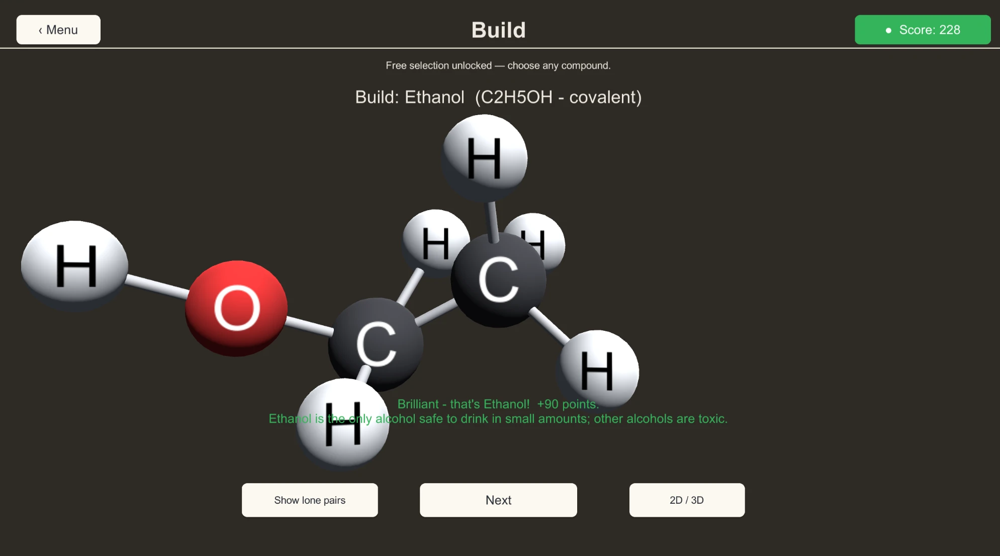

# COMPOUND IT

**Chemistry you can turn over in your hands.** Build molecules atom by atom,
identify them on sight, work out what reacts with what — and rotate any of them
in three dimensions to see how the thing is actually put together.

Made by [Wombyland](https://www.wombyland.com/). Windows, single player. Free.



---

## Download

**[⬇ Get the latest release](../../releases/latest)**

| | |
|---|---|
| **Installer** — `CompoundIt-1.0-Setup.exe` | Recommended. Installs for the current user only, so it needs no administrator rights — useful on a school machine where you may not be an administrator. |
| **Portable zip** — `CompoundIt-1.0-Windows.zip` | No installation at all. Unzip anywhere, including a USB stick, and run `COMPOUND IT.exe`. |

### Windows will warn you about this download

COMPOUND IT is not code-signed — certificates cost several hundred dollars a
year, which is difficult to justify for a free game. Windows SmartScreen will
show **"Windows protected your PC"** when you run the installer. Click **More
info**, then **Run anyway**.

This warning means Microsoft has not seen the file often enough to have formed an
opinion of it. It is not a virus report. Every release lists a SHA-256 checksum
you can compare against `Get-FileHash` in PowerShell.

**If Windows refuses outright, with no "Run anyway" option**, the machine has
Smart App Control switched on. That is stricter than SmartScreen and blocks
unsigned software rather than warning about it. The portable zip sometimes
passes where the installer does not — which also makes it the better choice on a
managed school computer.

---

## Requirements

| | |
|---|---|
| **Operating system** | Windows 10 or 11, 64-bit |
| **Disk space** | Roughly 100 MB installed |

The game opens in a window sized to about two thirds of your screen, so it sits
alongside your notes rather than taking over the display.

---

## Six ways in

**Build** — assemble a named compound atom by atom. Get it right and you are told
what the molecule does in the world: that ethanol is the only alcohol safe to
drink, that ethene is flat because a double bond cannot rotate. Ten clean builds
unlock free selection, after which you can build anything in the set.

**Identify** — a molecule appears; name it. There is a streak counter, and a
Lightning Round against the clock when you want the pressure.

**React** — choose two compounds, predict whether they react, and say what kind
of reaction it is.

**Explore** — put atoms together freely and find out whether what you made is a
real molecule. If it is, you are told what you discovered, and it goes into your
lab book.

**Quiz** — pick a topic and revise it: bonding, periodic trends, acids and bases,
reactions, states of matter, stoichiometry.

**Random Facts** — the fact deck on its own, for reading rather than testing.

**My Lab Book** keeps the tally — facts seen, compounds discovered, best
Lightning Round, achievements earned.

---

## Turning molecules over

Every molecule can be rotated and scaled. That is not decoration: it is how you
see that ethene is flat, that methane is a tetrahedron rather than a cross, that
the oxygen in ethanol sits off to one side.

**Show lone pairs** adds the non-bonding electrons. **2D / 3D** switches between
the flat Lewis diagram you would draw in an exercise book and the real shape.
Moving between those two representations is most of what the game is teaching.

---

## Fifty compounds, a hundred facts

Fifty compounds, ionic and covalent, each with its common and IUPAC name,
formula, VSEPR geometry, bonding, lone pairs and a real-world use. A hundred
facts with questions and explanations behind them.

**All of it is editable.** On first run the game copies its content files to a
writable folder on your computer:

```
%UserProfile%\AppData\LocalLow\Wombyland\COMPOUND IT\CompoundItContent
```

They are JSON and CSV, and a teacher can change them in a text editor — add a
compound, reword a fact, retune a quiz — without any development tools. Files are
parsed tolerantly: one malformed entry is skipped and logged with its line
number rather than breaking the file. **Content notes** on the main menu reports
anything it could not read.

---

## Uninstalling

Installed with the installer: **Settings → Apps → Installed apps → COMPOUND IT →
Uninstall**. Used the zip: delete the folder.

Your score, lab book and edited content live in
`%UserProfile%\AppData\LocalLow\Wombyland\COMPOUND IT` and are left alone by the
uninstaller. Delete that folder by hand if you want a clean slate. Audio volumes
are kept in the registry under `HKEY_CURRENT_USER\Software\Wombyland\COMPOUND IT`.

---

## Reporting a problem

Open an [issue](../../issues). What helps most: which mode you were in, the
compound involved, your Windows version, and the log from
`%UserProfile%\AppData\LocalLow\Wombyland\COMPOUND IT\Player.log`.

---

## About

COMPOUND IT is one of several games at
**[wombyland.com](https://www.wombyland.com/)**, where it can also be played in a
browser.

This repository distributes the game only. It contains no source code — see
[LICENSE.txt](LICENSE.txt) for terms. Free for classroom use.
